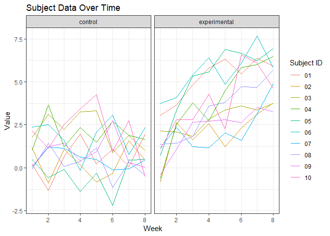

Homework 5
================
Rachel Tsong
9 November 2018

Problem 1
---------

``` r
## Load packages I'll use for problem 1
library(tidyverse)
```

    ## -- Attaching packages ----------------------------------------------------- tidyverse 1.2.1 --

    ## v ggplot2 3.0.0     v purrr   0.2.5
    ## v tibble  1.4.2     v dplyr   0.7.6
    ## v tidyr   0.8.1     v stringr 1.3.1
    ## v readr   1.1.1     v forcats 0.3.0

    ## -- Conflicts -------------------------------------------------------- tidyverse_conflicts() --
    ## x dplyr::filter() masks stats::filter()
    ## x dplyr::lag()    masks stats::lag()

``` r
library(ggplot2)
```

``` r
## Make a data frame consisting of file names
study_files = tibble(subject = list.files("./data")) %>%
  mutate(subject = str_c("./data/", subject))

## Make a dataframe using map to read files for each subject 
study_raw = study_files %>%
  mutate(subject_data = map(study_files$subject, read_csv)) %>% 
  unnest()

head(study_raw)
```

    ## # A tibble: 6 x 9
    ##   subject           week_1 week_2 week_3 week_4 week_5 week_6 week_7 week_8
    ##   <chr>              <dbl>  <dbl>  <dbl>  <dbl>  <dbl>  <dbl>  <dbl>  <dbl>
    ## 1 ./data/con_01.csv   0.2  -1.31    0.66   1.96   0.23   1.09   0.05   1.94
    ## 2 ./data/con_02.csv   1.13 -0.88    1.07   0.17  -0.83  -0.31   1.58   0.44
    ## 3 ./data/con_03.csv   1.77  3.11    2.22   3.26   3.31   0.89   1.88   1.01
    ## 4 ./data/con_04.csv   1.04  3.66    1.22   2.33   1.47   2.7    1.87   1.66
    ## 5 ./data/con_05.csv   0.47 -0.580  -0.09  -1.37  -0.32  -2.17   0.45   0.48
    ## 6 ./data/con_06.csv   2.37  2.5     1.59  -0.16   2.08   3.07   0.78   2.35

After importing the files into a dataframe, I made a new dataframe containing the data from each file. The current dataframe contains the subject ID information and readings for each week in the study. Now, I need to tidy the data by creating variables for control/experimental, subject ID, and week.

``` r
## Make a variable for "week" and change variable type, extract subject information from subject variable and create columns for "group" and "subject"
study_data = study_raw %>% 
  gather(key = "week", value = "value", week_1:week_8) %>%
  mutate(week = as.numeric((str_replace(week, "week_", ""))))  %>%
  mutate(subject = str_extract(subject, "[:lower:][:lower:][:lower:]_[:digit:][:digit:]")) %>%
  separate(subject, into = c("group", "subject_ID")) %>%
  mutate(group = recode(group, con = "control", exp = "experimental"))

head(study_data)
```

    ## # A tibble: 6 x 4
    ##   group   subject_ID  week value
    ##   <chr>   <chr>      <dbl> <dbl>
    ## 1 control 01             1  0.2 
    ## 2 control 02             1  1.13
    ## 3 control 03             1  1.77
    ## 4 control 04             1  1.04
    ## 5 control 05             1  0.47
    ## 6 control 06             1  2.37

``` r
## Make a spaghetti plot showing change over time for each subject and facet by group
study_data %>%
  ggplot(aes(x = week, y = value, color = subject_ID)) +
    geom_line() +
    facet_grid(~group) +
    labs(x = "Week", y = "Value", color = "Subject ID", title = "Subject Data Over Time") +
    theme_bw()
```



Starting at week 1, the values for the subjects in both groups were similar. However, over time, the values for the subjects in the experimental arm increased steadily over time, while the values for the subjects in the control arm remained relatively constant from week 1 to week 8.

Problem 2
---------

### Part 1: Import data, describe, and summarize homicides

``` r
## Import dataset
homicide_raw = read_csv(url("https://raw.githubusercontent.com/washingtonpost/data-homicides/master/homicide-data.csv"))
```

    ## Parsed with column specification:
    ## cols(
    ##   uid = col_character(),
    ##   reported_date = col_integer(),
    ##   victim_last = col_character(),
    ##   victim_first = col_character(),
    ##   victim_race = col_character(),
    ##   victim_age = col_character(),
    ##   victim_sex = col_character(),
    ##   city = col_character(),
    ##   state = col_character(),
    ##   lat = col_double(),
    ##   lon = col_double(),
    ##   disposition = col_character()
    ## )

**Description of data** This dataset contains homicide information from 50 large US cities across 28 states from 2010 to 2016. In total, there are 52179 total victims included in the dataset. Information about the victim including the first and last name, sex, race, and age is included as well as information regarding the location of the homicide including city, state, and geographic coordinates. Lastly, there is a variable for the disposition of the case. This variable gives information about whether the case is open or closed and whether or not an arrest was made.

``` r
## Create a city_state variable and an unsolved variable
homicide_data = homicide_raw %>%
  mutate(city_state = str_c(city, state, sep = ", ")) %>%
  mutate(unsolved = as.logical(ifelse(disposition != "Closed by arrest", 1, 0))) 

## Determine number of unsolved homicides and total homicides for each city
homicide_data %>%
  group_by(city_state) %>%
  summarize(unsolved = sum(unsolved), total = n()) %>%
  arrange(-total) %>%
  knitr::kable()
```

| city\_state        |  unsolved|  total|
|:-------------------|---------:|------:|
| Chicago, IL        |      4073|   5535|
| Philadelphia, PA   |      1360|   3037|
| Houston, TX        |      1493|   2942|
| Baltimore, MD      |      1825|   2827|
| Detroit, MI        |      1482|   2519|
| Los Angeles, CA    |      1106|   2257|
| St. Louis, MO      |       905|   1677|
| Dallas, TX         |       754|   1567|
| Memphis, TN        |       483|   1514|
| New Orleans, LA    |       930|   1434|
| Las Vegas, NV      |       572|   1381|
| Washington, DC     |       589|   1345|
| Indianapolis, IN   |       594|   1322|
| Kansas City, MO    |       486|   1190|
| Jacksonville, FL   |       597|   1168|
| Milwaukee, wI      |       403|   1115|
| Columbus, OH       |       575|   1084|
| Atlanta, GA        |       373|    973|
| Oakland, CA        |       508|    947|
| Phoenix, AZ        |       504|    914|
| San Antonio, TX    |       357|    833|
| Birmingham, AL     |       347|    800|
| Nashville, TN      |       278|    767|
| Miami, FL          |       450|    744|
| Cincinnati, OH     |       309|    694|
| Charlotte, NC      |       206|    687|
| Oklahoma City, OK  |       326|    672|
| San Francisco, CA  |       336|    663|
| Pittsburgh, PA     |       337|    631|
| New York, NY       |       243|    627|
| Boston, MA         |       310|    614|
| Tulsa, OK          |       193|    583|
| Louisville, KY     |       261|    576|
| Fort Worth, TX     |       255|    549|
| Buffalo, NY        |       319|    521|
| Fresno, CA         |       169|    487|
| San Diego, CA      |       175|    461|
| Stockton, CA       |       266|    444|
| Richmond, VA       |       113|    429|
| Baton Rouge, LA    |       196|    424|
| Omaha, NE          |       169|    409|
| Albuquerque, NM    |       146|    378|
| Long Beach, CA     |       156|    378|
| Sacramento, CA     |       139|    376|
| Minneapolis, MN    |       187|    366|
| Denver, CO         |       169|    312|
| Durham, NC         |       101|    276|
| San Bernardino, CA |       170|    275|
| Savannah, GA       |       115|    246|
| Tampa, FL          |        95|    208|
| Tulsa, AL          |         0|      1|

### Part 2:

``` r
## Make a dataframe containing homicide information for only Baltimore
baltimore_data = homicide_data %>%
  filter(city_state == "Baltimore, MD") %>% 
  group_by(city_state) %>%
  summarize(unsolved = sum(unsolved), total = n()) 

## Perform prop.test on "baltimore_data" and store as a list called "baltimore_prop_test"
baltimore_prop_test = prop.test(baltimore_data$unsolved, baltimore_data$total)

## Convert to tibble
broom::tidy(baltimore_prop_test) %>%
  select(estimate, conf.low, conf.high) %>% 
  knitr::kable(digits = 3)
```

|  estimate|  conf.low|  conf.high|
|---------:|---------:|----------:|
|     0.646|     0.628|      0.663|
